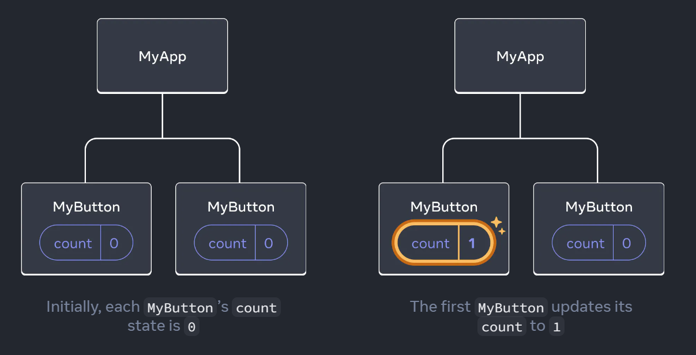
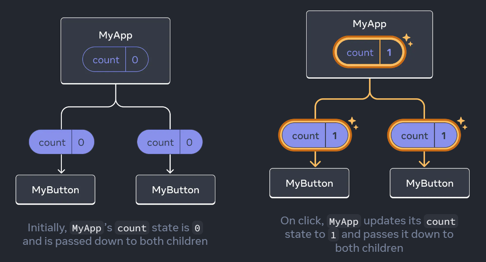

# React docs - Quick Start

> **Quick Links**: 
> [Table of contents](../contents.md) | [Previous: Installation](../notes/installation.md) | [Next - Project: Tic-Tec-Toe](./tic-tac-toe.md)

Now we have a running project, we obviously do not understand every line of it but we can start learning React JS concepts as well as practice them. Thus, it is time to go to React official documents.

On [React JS website](https://react.dev/), if we select `Learn`, we will land on [Quick Start](https://react.dev/learn) page. It starts with the following claim:

`Welcome to the React documentation! This page will give you an introduction to the 80% of React concepts that you will use on a daily basis.`

The goal of the chapter is listed as follow:

- How to create and nest components
- How to add markup and styles
- How to display data
- How to render conditions and lists
- How to respond to events and update the screen
- How to share data between components

Let's start with them.

## Before we start

Please start your local development server, if it is not already running, as follow:

```bash
cd src/react-vite
npm run dev
```

After that, open the URL `http://127.0.0.1:5173/` in the browser.

Now we should update our file `src\react-vite\src\App.jsx` as follow:

```jsx
import { useState } from 'react'

function App() {
  return (
    <div>
      <h1>Hello world! This is my first react app.</h1>
    </div>
  )
}

export default App
```

In this file, we just removed existing code, so that we get a clean slate to write the code we are going to learn in this section and beyond, while we are using this project.

### Updating the code without restarting dev-server.

We made the code changes but you may notice they are not reflected in the browser. Reason is, Vite is not looking if you modified the code. We may ask vite to check that.

Update your `src/react-vite/vite.config.js` file as follow:

```js
import { defineConfig } from 'vite'
import react from '@vitejs/plugin-react'

// https://vitejs.dev/config/
export default defineConfig({
  plugins: [react()],
  server: {
    watch: {
      usePolling: true
    }
  }
})
```

We added the `server` section and asked Vite to `watch` change in the code using `usePolling: true`. After that, Vite will keep track if we make any change in any file and update the browser, without we restart the server.

However, for this change to take effect, we need to restart the server one last time. Press `Ctrl + c` to stop the server and run `npm run dev` again.

Open `http://127.0.0.1:5173/` again in the browser and you may see some ugly text. Don't worry, we will make it look good soon. But for now, try changing that text. Is that change updated in browser automatically? If yes, we are well set to just to the first section of the documentation.

> ### Version: `v3.0.0`
>
> Changes in the vite config can be seen on branch `v3.0.0`

## 1. Creating and nesting components

Based on the docs, let's update our app.jsx as follow:

```jsx
import { useState } from 'react'

function MyButton() {
  return (
    <button>I'm a button</button>
  );
}

export default function MyApp() {
  return (
    <div>
      <h1>Welcome to my app</h1>
      <MyButton />
    </div>
  );
}
```

Here, we added a function `MyButton` and removed `export default App`. however, we added `export default` before function `MyApp`. This is exactly same. Each JavaScript can export one function or variable by default. We cna write it as separate line or in front of function definition. So what exactly we did here?

- We made our first react component by name `MyButton`.
  - In its simplest form, React component is a simple JavaScript function that returns markup.
- Then we used our component in existing `MyApp` component.
  - We did it by using `<MyButton /> tag.
- Notes:
  - As you can see, notmal HTML tags `<div>`, and `<h1>` starts with lowercase letter. On infact wole tag in is lowercase letters.
  - On the other hand, `React component must start with a Capital Letter`.

## 2. Add markup and styles

It looks like we returned HTML from the functions of our components `MyApp` and `MyButton`. However, this markup is not HTML, but JSX.

- Functions in React component returns JSX
- JSX is stricter that HTML.
  - We must have closing tag like `<dev></div>` of `<br />`.
- Component can return only one tag. So we must wrap our JSX code in `<dev> ... </div>` or empty wrapper `<> ... </>`.

If we have lot of HTML to be converted to JSC, we can use online converter tools - [(https://transform.tools/html-to-jsx)](https://transform.tools/html-to-jsx)

JSX is basicallt JavaScript and `class` is reserved keywork in JavaScript. This means we can not use HTML attribute `class`. We must use `className` instead. So `<div class="someclass"> ... </div>` should be used as `<div className="someclass"> ... <div>`.

## 3. Displaying data

JSX allow us to put markup into JavaScript. If we want to print some JavaScript, we have to escape it by curly braces like 

```JSX
return (
  <h1>
    {user.name}
  </h1>
);
```

If we want to print JavaScript in attributes, we escape that without double qoutes. Example:

```JSX
return (
  
);
```

We can have complex expression like String concatenation too. Example

```JSX
const user = {
  name: 'Hedy Lamarr',
  imageUrl: 'https://i.imgur.com/yXOvdOSs.jpg',
  imageSize: 90,
};

export default function Profile() {
  return (
    <>
      <h1>{user.name}</h1>
      
    </>
  );
}
```

 In above example, `style={{ }}` is not a special syntex. Its regular JS object {} inside `style={ }` JSX curly braces.

 ## 4. Conditional rendering

In JSX, there is no special syntex for writing conditions.  We use JS code as

```JSX
let content;
if (isLoggedIn) {
  content = <AdminPanel />;
} else {
  content = <LoginForm />;
}
return (
  <div>
    {content}
  </div>
);
```

If we want to do it in JSX, we can:

```JSX
<div>
  {isLoggedIn ? (
    <AdminPanel />
  ) : (
    <LoginForm />
  )}
</div>
```

If we do not need else, we can further shorten it as:

```JSX
<div>
  {isLoggedIn && <AdminPanel />}
</div>
```

## 5. Rendering list

In JavaScript, we use loops like for and while or array map() function to render list. In such cases, we make markup in JavaScript and display it where needed.

```JSX
const products = [
  { title: 'Cabbage', isFruit: false, id: 1 },
  { title: 'Garlic', isFruit: false, id: 2 },
  { title: 'Apple', isFruit: true, id: 3 },
];

export default function ShoppingList() {
  const listItems = products.map(product =>
    <li
      key={product.id}
      style={{
        color: product.isFruit ? 'magenta' : 'darkgreen'
      }}
    >
      {product.title}
    </li>
  );

  return (
    <ul>{listItems}</ul>
  );
}
```

## 6. Responding to events

```JSX
function MyButton() {
  function handleClick() {
    alert('You clicked me!');
  }

  return (
    <button onClick={handleClick}>
      Click me
    </button>
  );
}
```

## 7. Updating the screen

```JSX
import { useState } from 'react';

export default function MyApp() {
  return (
    <div>
      <h1>Counters that update separately</h1>
      <MyButton />
      <MyButton />
    </div>
  );
}

function MyButton() {
  const [count, setCount] = useState(0);

  function handleClick() {
    setCount(count + 1);
  }

  return (
    <button onClick={handleClick}>
      Clicked {count} times
    </button>
  );
}
```

In first line, we imported `useState` from react. Anything that start with `use` is a React hook.

Then we added MyBotton twice in the main MyApp component.

MyButton is another component, defined after MyApp. There, we initialize a stage by `const [count, setCount] = useState(0);`. It returns a variable and a function, that we saved as count and setCount.

> It is not mandatory but recommended and common practive to keet the names as `anyName` and `setAnyName`.

Then we defined a function `handleClick` and called out `setCount` in it to update the count.

At last, on the buttons 'onClick' property, we calledout `handleClick` function to set the stage (count)

If you run this, you will find we have two buttons and both managing their state individually. That is, clicking one button increase onlt its count, not the other way button's count.

> ### Version: `v3.7.0`
>
> Code demonstrating useState hook `v3.7.0`

## 8. Sharing data between components

In previous example, both button have individual state as their state is maintained in MyButton component.



Let's assume we want both button to show same count



In above image, we moved state to the parent component MyApp. Doing so will allow use to pass the state to both MyButtons.

```JSX
import { useState } from 'react';

export default function MyApp() {
  const [count, setCount] = useState(0);

  function handleClick() {
    setCount(count + 1);
  }

  return (
    <div>
      <h1>Counters that update together</h1>
      <MyButton count={count} onClick={handleClick} />
      <MyButton count={count} onClick={handleClick} />
    </div>
  );
}

function MyButton({ count, onClick }) {
  return (
    <button onClick={onClick}>
      Clicked {count} times
    </button>
  );
}
```

Let's review this code.

- We first move count state from MyButton to MyApp.
- Now we need to pass that state to the MyButton. We do it by using `count={count}` as attribute in MyButton. This is called `props`.
- Now if we click on the button, we have no stage in MyButton to manage. So we sent onClick event to the MyButton. The code is on MyButton in MyApp `onClick={handleClick}`.
- Since we are passing count and onClick to MyButton, it will recieve it as parameter `MyButton({ count, onClick })`
  - Once we have it, we can display count as {count} and call onclick as `<button onClick={onClick}>`

> ### Version: `v3.8.0`
>
> Code demonstrating useState hook in parent component `v3.8.0`

## Next steps

Was it easy? Well we just covered the part of the react that we will be mostly using in most of the project.

However, we have not yet covered 20%. that will be 80% ofreal project code but we are on nearly half-way mark to achieve that goal.

Our next goal is to make a real project, where we will use what we learned till now. As per react docs, we are going to make a Tic-Tac-toe game.

Let thefun begin.

## Summary / Important points

- Section 1: Creating and nesting components
  - React apps are made out of components.
  - A component is a part of UI (User Interface) that has its own logic and appearance.
  - React component must start with a Capital Letter.
- Section 2: Add markup and style
  - Functions in React component returns JSX
  - JSX is stricter than HTML.
    - We must have closing tag like `<dev></div>` or `<br />`.
  - Component can return only one tag.
    - We must wrap our JSX code in `<dev> ... </div>` or empty wrapper `<> ... </>`.
  - Styles
    - Use `className` instead of `class` in tag attributes.
      - `<div className="someclass"> ... <div>`
- Section 3: Displaying data
  - JSX by default have (HTML like) Markup.
  - We use curly braces to escape JS values.
    - <h1>{user.name}</h1>
  - In attributes, while escaping, dont use double quotes
    - ``
- Section 4: Conditional Rendering
  - In JSX, there is no special syntex for writing conditions.

```JSX
let content;
if (isLoggedIn) {
  content = <AdminPanel />;
} else {
  content = <LoginForm />;
}
return (
  <div>
    {content}
  </div>
);
```

- - Using Ternary operator

```JSX
<div>
  {isLoggedIn ? (
    <AdminPanel />
  ) : (
    <LoginForm />
  )}
</div>
```

- - When we do not need else branch, we can use `&&` operator `{isLoggedIn && <AdminPanel />}`

- Section 5: Rendering List
  - In case of loops,  we make markup in JavaScript.
- Section 6: Events
  - Events on browser are user actions like click, type, change (text, dropdown),select etc.
  - In react, we can handle event like `<button onClick={handleClick}>`.
    - Note: we are not calling the function by adding (). React will call it, when actual event happens.
- Section 7: Updating the screen
  - useState hook
    - `import { useState } from 'react';`
    - `const [count, setCount] = useState(0);`
      - `count` is the variable.
      - `setCount` is the setter. General convention for the name is `set` followed by Variable name
      - Value passed in useStage function is initial value.
    - `function handleClick() { setCount(count + 1); }`
    We can now use it as `<button onClick={handleClick}>`
    - When we set state and use component multiple times, each instance gets its own state, independent of other.
  - Hooks
    - Any function that starts with `use` are called Hooks.
    - `useState` is one hook. We can find more in API reference - [https://react.dev/reference/react]().
    - We can write custom hooks by combining the existing hooks.
    - Hooks are more restrictive than other functions
      - We can call hooks at the top of components or other hooks.
      - If we want to use `useState` in a condition or a loop, extract a new component and put it there.
- Section 8: Sharing data berween components.
  - If we want a state to be shared between two components, move the state to the parent component.
  - Parent component can send state as `props` and also could send a function to be called on an event.
    - `<MyButton count={count} onClick={handleClick} />`
  - Chile components will get it as function parameters
    - `function MyButton({ count, onClick })`
  - It can then use it as needed
    - `<button onClick={onClick}>`
    - `Clicked {count} times`

> **Quick Links**: 
> [Table of contents](../contents.md) | [Previous: Installation](../notes/installation.md) | [Next - Project: Tic-Tec-Toe](./tic-tac-toe.md)
